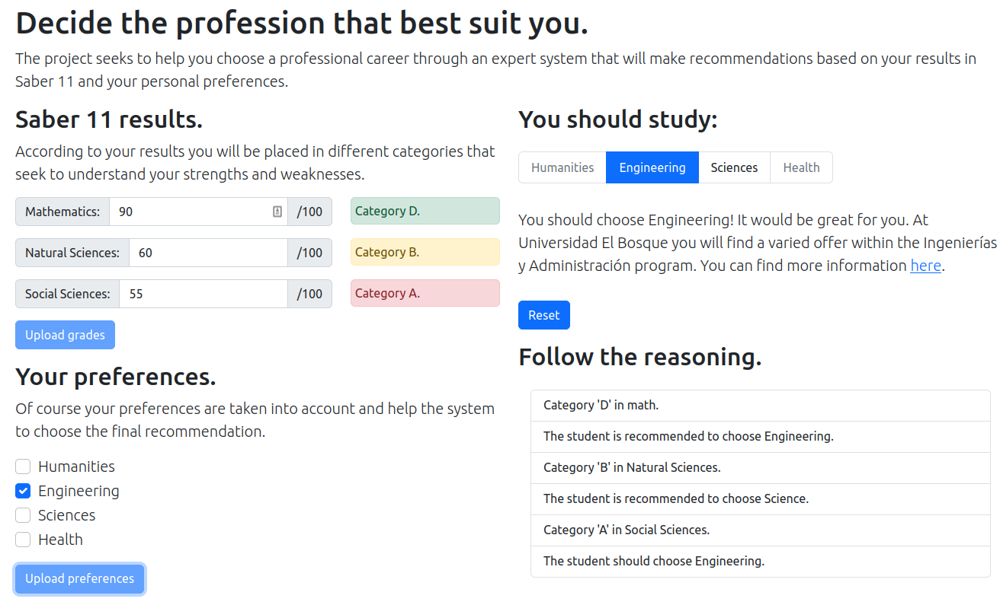
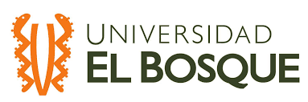

# Rule-based system to recommend professional career

Rule-based system created using python [Experta](https://github.com/nilp0inter/experta) that recommends to the user a professional carrer field based on their Saber 11 test results and their personal preferences.

The project was developed for the subject Sistemas Inteligentes from the program Ingeniería de Sistemas at Universidad El Bosque, where I was an international student for one semester. We were studying the teory and tools behind expert systems, and we were proposed to make an expert system that recommend the user a professional career path based on some personal information.

The solution is based on the following:

- Developed with python 3.7 (important for experta dependency)
- Python experta for the tools to make the expert system.
- Flask as web framework for the server.
- Gunicorn for the WSGI HTTP Server.
- Bootstrap for a better looking webpage.

## A summary on how it works

All the project could be divided in three main parts: the expert system development, the server implementation and the front-end, client side or graphical user interface.

### The expert system design

The expert system is design using the package [Experta](https://github.com/nilp0inter/experta), which allows to make rule-based system with python. You can see how it works in the package doncumentation, here there is a brief detail on the rules that make the system work:

The user enters their Saber 11 results which consist of grades between 0 and 100 in the subjects Mathematics, Natural Sciences and Social Sciences. Based on those grades the user is classified in different categories, and then the system make some recommendations that can be to study a career related to Engineering, Health, Science or Humanities.

The user now can enter their career preferences, and then with that information the system can make the final choice of career. 

You can find the code for the knowledge engine in [app/knowledgeengine.py](./app/knowledgeengine.py), with all the rules that implement what was explained before.

### The client or GUI

In order to give the user an easy way to enter their data, a graphical user interface was design using HTML5, CSS and Javascript. For a modern and responsive web, the CSS framework [Bootstrap](https://getbootstrap.com/) was used. The project uses the CDN of the framework so you don't need to download anything.



### The server implementation

The server side of the project is implemented with [Flask](https://flask.palletsprojects.com/en/2.1.x/), and together with the Javascript code allows the communication between the expert system and the webpage.

## Take a look to the project in action! 🚀

The project is deployed in Heroku, you can try it visiting [recommend-career.herokuapp.com](http://www.recommend-career.herokuapp.com/), put your own
input and open an issue here if you see something wrong or something you want to add.

To see how to deploy the app in Heroku I would recommend [this guide from RealPython](https://realpython.com/flask-by-example-part-1-project-setup/).

## Run the project locally

If you want to run the project in your computer you need to install the python dependecies:

```shell
pip3 install -r requirements.txt
```

Once you install it you only need to run with `python` one of the following files:

- `wsgi.py`: if you want to start the server with the version of the project deplyed in Heroku.
- `app/main.py`: if you want to start the server in debug mode and play with the GUI.
- `app/knowledgeengine.py`: if you want to play with python experta only and make changes to the expert system.

## How to Contribute

Please, feel free to open an issue or make a pull request with any change or feature you want to add. I'll be glad to help you.

## More about Saber 11

The Saber 11 exam evaluates the degree of development of the academic skills of students who are about to finish the eleventh grade of secondary education. It consists of two sessions in which five tests are carried out: Critical Reading, Mathematics, Social and Citizen Sciences, Natural and English; and a socioeconomic questionnaire. 
The presentation of this exam is a requirement to access higher education in Colombia and is used as an admission criterion by several universities.

For more information visit [www.icfes.gov.co](www.icfes.gov.co)

## License

The project is under the [MIT License](LICENSE).

## Author and Institution
Gonzalo G. Fernández [ggfernandez@unbosque.edu.co](mailto:ggfernandez@unbosque.edu.co) [fernandez.gfg@gmail.com](mailto:fernandez.gfg@gmail.com)

Sistemas Inteligentes - Programa de Ingeniería de Sistemas - Universidad El Bosque, Bogotá, Colombia.

